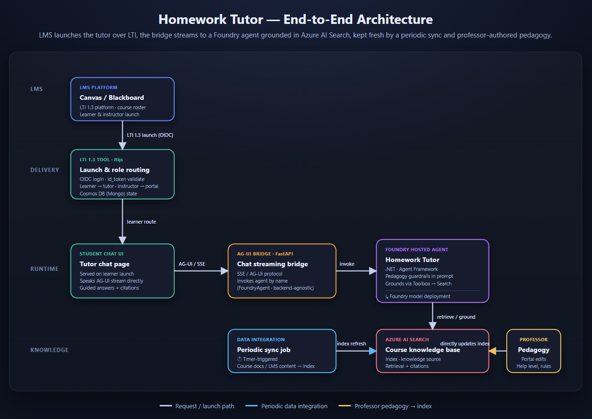
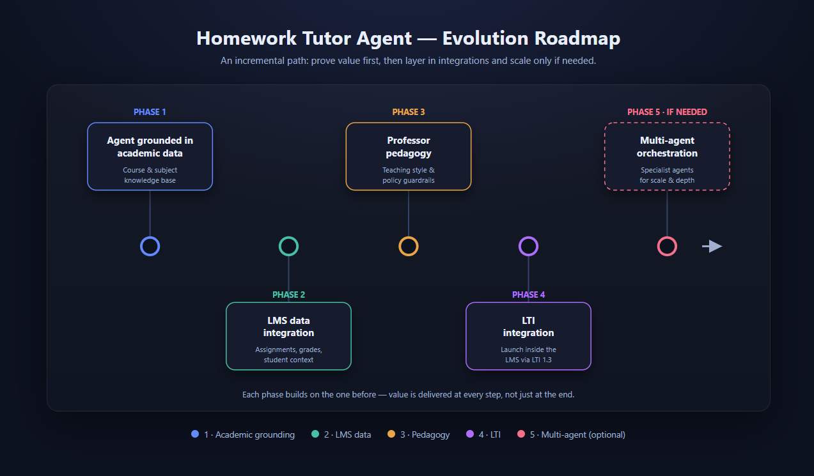

# EDU Homework Agent Accelerator

A hands-on accelerator for building a student homework tutor on Microsoft
Foundry, grounding it in approved course material with Azure AI Search, and
evolving it toward LMS delivery and professor-owned pedagogy.

The main path in this repository is the **Phase 1 lab**: deploy a slim Foundry +
Azure AI Search stack and professor portal, seed a course knowledge base, create
the tutor in the Foundry portal, and verify grounded answers with citations. The
lab also deploys the asynchronous pipeline that imports a Canvas course export
(`.imscc`) and indexes its teaching material. It does not deploy an LTI tool.

## Target architecture

The lab proves the agent and knowledge layer at the center of the design. The
diagram below shows the end-to-end target architecture, including the later LMS,
delivery, data-integration, and pedagogy layers.



## Start here: build the grounded tutor

The guided lab takes about **2-3 hours** and has four steps:

| Step | Outcome | Where |
| --- | --- | --- |
| 1. Deploy the lab | Foundry project, models, Azure AI Search, professor portal, RBAC, and project connection | Terminal |
| 2. Seed course knowledge | Search index, knowledge source, knowledge base, and sample microbiology content | Terminal |
| 3. Create the tutor | `homework-tutor` agent using the provided instructions | Foundry portal |
| 4. Add knowledge | Grounded, cited responses in the Foundry Playground | Foundry portal |

Follow the complete [getting started guide](docs/getting-started.md) for
prerequisites, portal steps, verification, cleanup, and troubleshooting.

### 1. Deploy the lab infrastructure

First create a single-tenant **Entra app registration** and a client secret — the
professor portal requires sign-in and has no anonymous mode. Leave its redirect
URI empty for now; you add it after this step, once the hostname exists.

From the repository root, choose a short environment name and run:

```powershell
./lab/deploy.ps1 -EnvironmentName eduhw01 `
  -PortalAuthClientId '<application-id>' `
  -PortalAuthKeyVaultResourceGroup 'rg-eduhw01-auth' `
  -PortalAuthKeyVaultName '<globally-unique-vault-name>'
```

The script creates the Key Vault if it does not exist and prompts for the client
secret, writing it straight to the vault. App Service reads it from there at
runtime, so the secret is never stored as a site setting or written to disk.

Then add `<professor-portal-url>/.auth/login/aad/callback` to the registration,
using the portal URL the script prints. The App Service name carries a stable
hash, so don't guess the hostname. On the same **Authentication** blade, tick
**ID tokens (used for implicit and hybrid flows)** — Easy Auth uses the hybrid
flow and sign-in fails with `AADSTS700054` without it.

The lab provisions and deploys:

- a Microsoft Foundry account and `homework` project
- `gpt-5.4` and `gpt-5.4-mini` model deployments, plus a text-embedding deployment
- an Azure AI Search service
- the professor portal on Linux Azure App Service
- the course-import pipeline: a storage account with the import containers and
  status table, a Service Bus namespace, Event Grid subscriptions, a Functions
  dispatcher, and a Container Apps job (with its registry) that does the extraction
- the RBAC assignments and Foundry project connection needed for grounding

The infrastructure lives in [lab/infra](lab/infra), with the import pipeline
separated into [lab/infra/import-pipeline.bicep](lab/infra/import-pipeline.bicep).
It deliberately excludes MongoDB, the hosted agent container, and the LTI tool.

### Importing a course export

Once the portal is up, a professor signs in and uploads an `.imscc` export. The
browser uploads it straight to Blob Storage with a short-lived SAS, so the file
never passes through the portal and is not bounded by its request limits. Storage
raises an event, the dispatcher queues the work, and the Container Apps job
extracts the archive, keeps only the teaching material, and indexes it. The portal
polls the import for progress. See
[docs/imscc-parsing.md](docs/imscc-parsing.md) for what is kept and what is
discarded.

**The extraction worker is deployed by `azd up`.** It is an azd service like the
portal and the dispatcher, built remotely in Azure Container Registry, so Docker
is not needed locally. The job is provisioned against a public placeholder image
and `azd deploy` swaps in the real one, which is why provisioning and deploying
have to happen together — `azd up` does both. To redeploy just the worker after
changing it:

```powershell
cd lab; azd deploy extraction-worker
```

### 2. Create the search objects

The portal, the import pipeline and the tutor agent all read the same Azure AI
Search index. Create it, the pedagogy policy index, and both knowledge bases:

```powershell
./scripts/setup-policy-ingestion.ps1 -EnvironmentName eduhw01
./scripts/setup-knowledge-bases.ps1  -EnvironmentName eduhw01
```

Run them in that order. The second builds a knowledge source over the policy
index the first creates and fails outright without it.

Skipping this step is not obvious later: an imported course is extracted
successfully and then dead-letters when indexing finds no `course-content-index`
to write to.

### 3. Seed sample content (optional)

A knowledge base with no documents answers nothing, so to try the tutor before
importing a real course, load the sample material:

```powershell
python scripts/setup-knowledge-base.py --environment-name eduhw01
```

This creates the separate `course-materials` index, which is what the
[toolbox](toolbox/toolbox.yaml) `course-search` tool queries, and loads
[scripts/seed-data/microbiology.json](scripts/seed-data/microbiology.json) into it.

Be aware that this script and `setup-knowledge-bases.ps1` both create a Foundry
knowledge base named `course-knowledge-base`, each bound to its own index, so
whichever runs last owns the name. Run this one last if you want the agent to
answer from the sample content, and re-run it after any later run of
`setup-knowledge-bases.ps1`.

### 4. Create the agent in Foundry

Open the `homework` project in the Foundry portal, create an agent named
`homework-tutor` with the `gpt-5.4` deployment, and paste in
[lab/agent-instructions.md](lab/agent-instructions.md).

### 5. Attach knowledge and test

Add `course-knowledge-base` to the agent, save it, and ask:

> How do bacteria resist antibiotics?

The response should use the seeded course material and include citations. Ask a
question outside that material to verify that the tutor declines to invent an
answer.

## Evolution roadmap

The repository is organized so each phase can build on a working tutor rather
than requiring the entire platform up front.



| Phase | Focus | Repository starting points |
| --- | --- | --- |
| 1 | Agent grounded in academic data | [lab](lab), [scripts/setup-knowledge-base.py](scripts/setup-knowledge-base.py) |
| 2 | LMS data integration | [config/knowledge-sources.md](config/knowledge-sources.md), [toolbox](toolbox) |
| 3 | Professor-owned pedagogy | [src/HomeworkAgent/Pedagogy](src/HomeworkAgent/Pedagogy), [ui/app](ui/app) |
| 4 | LTI 1.3 launch and role routing | [lti-tool](lti-tool), [docs/lti-integration.md](docs/lti-integration.md) |
| 5 | Optional multi-agent orchestration | [scaling-to-multi-agents](scaling-to-multi-agents) |

The later-phase folders are implementation and exploration surfaces, not part of
the current lab deployment.

## Repository map

- [lab](lab) - the primary infrastructure and agent-creation lab
- [scripts](scripts) - knowledge setup and supporting automation
- [functions](functions) - the import dispatcher that turns storage events into extraction jobs
- [worker](worker) - the container job that extracts a course export, classifies its content, and indexes it
- [config](config) - knowledge-source guidance
- [src/HomeworkAgent](src/HomeworkAgent) - .NET Agent Framework tutor and pedagogy policy composition
- [toolbox](toolbox) - Foundry Toolbox definition for Azure AI Search
- [lti-tool](lti-tool) - LTI 1.3 launch and role-routing implementation
- [bridge](bridge) - AG-UI streaming bridge
- [ui](ui) - student tutor UI and professor portal. The browser bundle is
  generated, not committed: run `npm ci --prefix app` then `npm run build --prefix app`
  from `ui` before serving the portal locally. Deployment builds it for you.
- [foundry-tutor](foundry-tutor) - standalone hello-world Agent Framework sample, independent of the lab
- [scaling-to-multi-agents](scaling-to-multi-agents) - optional multi-agent evolution
- [docs](docs) - GitHub Pages documentation

## Documentation

- [Getting started](docs/getting-started.md) - the main lab walkthrough
- [Cohort runbook](docs/cohort-runbook.md) - running the lab as a live session
- [Configuration](docs/configuration.md) - deployment, pedagogy, and knowledge settings
- [Architecture](docs/architecture.md) - components and data flow
- [Course export parsing](docs/imscc-parsing.md) - what an `.imscc` import keeps and discards
- [LTI integration](docs/lti-integration.md) - the later LMS delivery phase
- [Published documentation](https://dbruun.github.io/edu-cohort-homework/)
