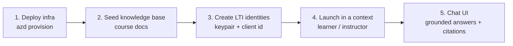

# EDU Homework Agent Accelerator

A student-facing **homework tutor** built on Microsoft Foundry Hosted Agents,
grounded in your course material through Azure AI Search, launched from your LMS
over LTI 1.3, and governed by a professor-owned pedagogy policy.

This README walks the **end-to-end story**: stand up the infrastructure, seed the
knowledge base with course docs, mint your own LTI identities, launch into a
course context, and land in a chat UI where the tutor answers — grounded on the
documents you provided and shaped by the pedagogy policy.

> **Running the customer lab?** Follow the guided
> [getting started guide](docs/getting-started.md): deploy a slim Foundry + Azure AI Search
> stack, seed a knowledge base, create the agent in the Foundry portal, and ground
> it in course material (~2–3 hours). It's the fastest path from zero to a working,
> grounded tutor.

## The story, end to end



---

### 1. Deploy the infrastructure

One command provisions the whole stack on Azure via the Azure Developer CLI:
the hosted **Foundry agent** + model deployment, the **Azure AI Search** service
(with a Foundry connection + a `gpt-5.4-mini` reasoning model for retrieval), the
**LTI 1.3 tool**, and the **professor portal** scaffold.

```powershell
./scripts/deploy.ps1 -EnvironmentName <your-env> -Location northcentralus
```

```bash
bash ./scripts/deploy.sh <your-env> northcentralus
```

This creates resource group `rg-<env>` and deploys every component. See
[scripts/README.md](scripts/README.md) for parameters and teardown, and
[docs/architecture.md](docs/architecture.md) for the topology.

> **Search SKU:** the search service defaults to **Basic** (fine for a pilot).
> Raise `searchSku` to `standard` (S1)+ for go-live — see
> [config/knowledge-sources.md](config/knowledge-sources.md).

### 2. Seed the knowledge base with course material

The tutor grounds its answers in an **Azure AI Search knowledge base**. This
script creates the index, knowledge source, and knowledge base, and loads seed
content (dummy microbiology data out of the box):

```powershell
./scripts/setup-knowledge-base.ps1 -EnvironmentName <your-env>
```

Replace the corpus with your own material by editing
[scripts/seed-data/microbiology.json](scripts/seed-data/microbiology.json) (or
passing `-SeedDataPath`) and re-running — it is idempotent. Every answer the
tutor later gives is retrieved from, and cites, these documents.

### 3. Create your own LTI identities

You act as your **own LTI 1.3 platform** — no dependency on an external LMS to
test. Generate the signing keypair and a client id:

```powershell
node scripts/gen-platform-key.mjs      # writes .platform-key.pem + prints LTI_KID
[guid]::NewGuid().ToString()           # your LTI client id
```

Register the public key on the deployed tool and fill in `scripts/.lti.env`. The
full walkthrough (registering the platform, populating `.lti.env`) is in
[scripts/README.md](scripts/README.md) and [docs/lti-configuration.md](docs/lti-configuration.md).

### 4. Launch into a course context

Drive a **real LTI 1.3 launch** against the deployed tool — the scripts sign the
`id_token` themselves and carry the state cookie in a single first-party context,
so launches validate and route by role without an LMS.

```powershell
# Headless PASS/FAIL proof (learner routes to the tutor, instructor to the portal)
node scripts/lti-launch.mjs --role learner
node scripts/lti-launch.mjs --role instructor

# Visual: opens a browser, renders the live tutor, and streams an answer
node scripts/lti-launch-browser.mjs --role learner --question "How do bacteria resist antibiotics?"
```

### 5. Land in the chat UI — grounded on your docs

The learner launch lands in the **student chat UI**
([ui/tutor/index.html](ui/tutor/index.html)), which speaks the agent's AG-UI
streaming protocol directly. Ask a homework question and the tutor streams back a
**guided answer grounded in the seeded course material** — hints and steps rather
than a direct solution to graded work, with citations — as configured by the
pedagogy policy. The instructor launch lands in the **professor portal**
([ui/app](ui/app)) for tuning that policy.

> **Cold start:** the agent scales to zero, so the first reply after idle can take
> up to ~2 minutes. Pre-warm it (hit the agent `/health`) before a live demo.

---

## What's included

- A **.NET hosted agent** using the Microsoft Agent Framework, exposed over AG-UI
- An **Azure AI Search knowledge base** + a Foundry Toolbox definition, extendable
  to more indexes without redeploying the agent
- An **LTI 1.3 tool** (ltijs) for LMS launch, with self-owned platform test scripts
- A **student chat UI** and a **professor portal** for pedagogy tuning
- **Bicep** infrastructure and **azd** deployment scripts
- A GitHub Pages-ready **documentation site**

## Repo structure

- [src/HomeworkAgent](src/HomeworkAgent) — hosted agent source and policy prompt composition
- [toolbox](toolbox) — Foundry Toolbox definition for Azure AI Search
- [scripts](scripts) — deploy, knowledge-base setup, and LTI launch scripts
- [scripts/seed-data](scripts/seed-data) — seed course material for the knowledge base
- [ui](ui) — student chat UI, professor portal, and API scaffold
- [infra](infra) — Bicep infrastructure as code
- [config](config) — knowledge-source management guidance
- [docs](docs) — Jekyll documentation site

## Local development

1. Build the agent: `dotnet build src/HomeworkAgent/HomeworkAgent.csproj`
2. Run the tests: `dotnet test src/HomeworkAgent.Tests/HomeworkAgent.Tests.csproj`
3. Build the portal: `npm --prefix ui/app run build`

## Documentation

- Start with [docs/index.md](docs/index.md) for the overview.
- See [docs/architecture.md](docs/architecture.md) for the system flow.
- See [docs/lti-integration.md](docs/lti-integration.md) and
  [docs/lti-configuration.md](docs/lti-configuration.md) for LMS launch.
- See [config/knowledge-sources.md](config/knowledge-sources.md) for grounding.
