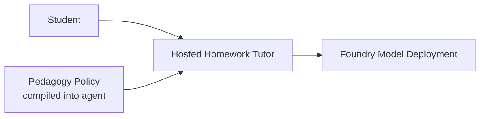
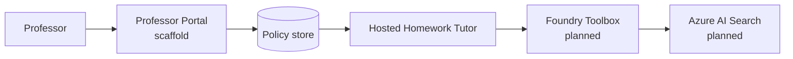
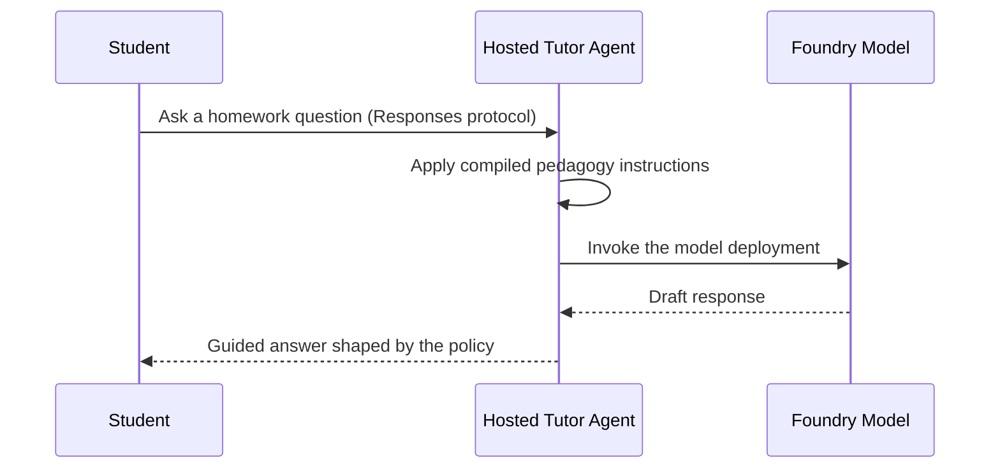

# Architecture overview

The accelerator is a **hosted agent on Microsoft Foundry**: a student-facing tutor whose pedagogy is owned by professors. The tutor answers homework questions under an explicit pedagogy policy that is compiled into the agent at deploy time.

> **What is deployed today vs. planned.** The hosted tutor + its Foundry model deployment are **live**. The Azure AI Search **toolbox** and the **professor portal** are scaffolding in this repo and are **not yet wired into the deployed agent**. Sections below mark each piece accordingly.

## System at a glance (deployed today)

The tutor runs as a hosted Foundry agent. Its instructions — including the pedagogy policy — are baked into the container image when it is deployed. To change tutoring behavior, a professor edits the policy and the agent is **redeployed**.

## Planned extension

The intended end state adds a professor portal that publishes policy changes and a Foundry Toolbox that grounds answers in Azure AI Search. Reaching a *live* per-request policy read requires either a Foundry connection or Standard Agent Setup (capability host); a plain blob read from the hosted container is blocked by the agent's managed-identity permissions in this environment.

## Core components

| Component | Status | Responsibility | Source |
| --- | --- | --- | --- |
| Hosted tutor agent | **Deployed** | Runs on Foundry; answers under the compiled pedagogy policy | [../foundry-tutor/hello-world-dotnet-agent-framework/src/hello-world-dotnet-agent-framework/Program.cs](../foundry-tutor/hello-world-dotnet-agent-framework/src/hello-world-dotnet-agent-framework/Program.cs) |
| Agent + model manifest | **Deployed** | Declares the agent, model deployment, and env vars | [../foundry-tutor/hello-world-dotnet-agent-framework/azure.yaml](../foundry-tutor/hello-world-dotnet-agent-framework/azure.yaml) |
| Pedagogy policy | **Deployed (compiled in)** | The rules the tutor follows; also seeded as JSON | [../src/HomeworkAgent/Pedagogy/pedagogy-policy.json](../src/HomeworkAgent/Pedagogy/pedagogy-policy.json) |
| Foundry Toolbox | Planned | Curated Azure AI Search knowledge access | [../toolbox/toolbox.yaml](../toolbox/toolbox.yaml) |
| Professor Portal | Scaffold | UI for editing pedagogy | [../ui/app/src/App.jsx](../ui/app/src/App.jsx) |
| Portal API | Scaffold | Reads/writes policy | [../ui/api/index.js](../ui/api/index.js) |

## Request flow (deployed today)

1. **Invoke.** A caller sends a message to the agent's Responses endpoint (for example via `azd ai agent invoke`).
2. **Apply policy.** The agent's instructions — carrying the pedagogy guardrails compiled in at deploy time — shape the model call.
3. **Answer.** The tutor returns a guided response: hints and steps rather than a direct solution to graded work.

## Pedagogy as configuration

The policy is a small, declarative JSON document. It expresses:

- **helpLevel** — `hint_only`, `guided`, `worked_example`, or `full_solution`
- **maxStepsRevealed** — how much of a solution the tutor may expose at once
- **allowDirectAnswers** — whether a direct solution is ever permitted
- **citationsRequired** — whether responses must cite sources
- **subjectOverrides** — per-subject adjustments

Today this policy is folded into the agent's instructions at deploy time, so changing it means editing the policy and **redeploying** the agent. The planned portal + connection design would let professors change it without a redeploy. See the [configuration guide](configuration.md) for the full schema.

## Knowledge access through the toolbox (planned)

The Foundry Toolbox is the intended boundary between the tutor and course knowledge: it would define which Azure AI Search indexes are in scope and how they are queried. It is defined in [../toolbox/toolbox.yaml](../toolbox/toolbox.yaml) but is **not yet connected** to the deployed agent.

## Deployment topology

- The tutor is deployed as a **hosted Foundry agent** (not a self-managed container) via Azure Developer CLI.
- A Foundry **model deployment** backs the agent.
- The professor portal (static web app + API) is scaffolding and is not part of the current deploy.

See [../scripts/deploy.ps1](../scripts/deploy.ps1) or [../scripts/deploy.sh](../scripts/deploy.sh) for the deployment entry points.

## Design principles

- **Pedagogy is explicit.** The tutor's limits live in a policy, not scattered through prose.
- **Foundry hosts the runtime.** Auth, scaling, and the model call are managed by Foundry, not hand-rolled.
- **Extend through governed boundaries.** Knowledge access is intended to flow through a toolbox/connection, keeping sources approved and auditable.
- **Be honest about state.** Deployed pieces and planned pieces are labeled so operators know what actually runs.
