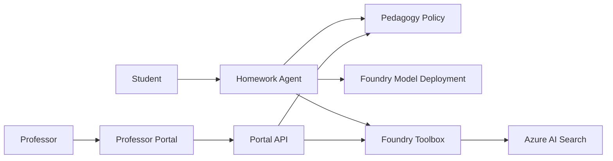
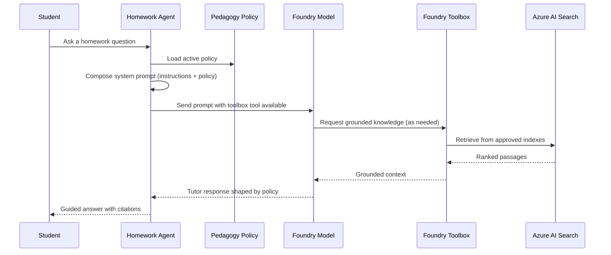

# Architecture overview

The accelerator is a hosted-agent solution that pairs a student-facing tutor with a professor-facing control plane. The tutor answers homework questions, but *how much* help it gives and *what knowledge* it draws on are both governed by configuration that professors own — no redeploys required.

## System at a glance

At runtime the agent reads the active pedagogy policy, composes a system prompt, invokes the model deployment, and grounds responses through the toolbox. Professors change tutoring behavior and knowledge access through the portal, and those changes take effect without redeploying the agent.

## Core components

| Component | Responsibility | Source |
| --- | --- | --- |
| Homework Agent | Hosts the tutor runtime, composes prompts, applies policy, calls the model and toolbox | [../src/HomeworkAgent/Program.cs](../src/HomeworkAgent/Program.cs) |
| Prompt Composer | Merges the base tutor instructions with the current policy into a single system prompt | [../src/HomeworkAgent/PromptComposer.cs](../src/HomeworkAgent/PromptComposer.cs) |
| Pedagogy Policy | Declarative rules for help level, step limits, direct answers, and citations | [../src/HomeworkAgent/Pedagogy/PedagogyPolicy.cs](../src/HomeworkAgent/Pedagogy/PedagogyPolicy.cs) |
| Foundry Toolbox | Curated, versioned knowledge access over Azure AI Search indexes | [../toolbox/toolbox.yaml](../toolbox/toolbox.yaml) |
| Professor Portal | UI for tuning pedagogy and reviewing knowledge sources | [../ui/app/src/App.jsx](../ui/app/src/App.jsx) |
| Portal API | Reads and writes policy and knowledge-source configuration | [../ui/api/index.js](../ui/api/index.js) |

## Request flow

When a student asks a question, the agent executes a fixed sequence:

1. **Load policy.** The agent resolves the policy location and loads the current rules at request time, so the newest professor settings always apply.
2. **Compose the prompt.** The prompt composer combines the base tutor instructions with a serialized copy of the active policy, giving the model explicit guardrails.
3. **Invoke the model.** The agent calls the configured Foundry model deployment and exposes the toolbox as an available tool.
4. **Ground the answer.** When the model needs course knowledge, the toolbox retrieves from the approved Azure AI Search indexes and returns ranked context.
5. **Return a guided response.** The reply reflects the configured help level, step limits, and citation requirements rather than simply solving the problem.

## The two planes

The design separates the **runtime plane** (what students touch) from the **control plane** (what professors touch).

- **Runtime plane** — the hosted agent, model deployment, and toolbox. It is stateless per request and reads its behavior from configuration.
- **Control plane** — the professor portal and its API. It owns the pedagogy policy and knowledge-source configuration and publishes changes the runtime plane consumes.

This separation is what lets professors adjust tutoring behavior in near real time: the agent does not hardcode pedagogy, it reads it.

## Pedagogy as configuration

The policy is a small, declarative document rather than code. It controls:

- **helpLevel** — `hint_only`, `guided`, `worked_example`, or `full_solution`
- **maxStepsRevealed** — how much of a solution the tutor may expose at once
- **allowDirectAnswers** — whether a direct solution is ever permitted
- **citationsRequired** — whether responses must cite retrieved sources
- **subjectOverrides** — per-subject adjustments layered on top of the defaults

Because the agent reads this at runtime, the same deployed tutor can behave very differently across courses and assignments. See the [configuration guide](configuration.md) for the full schema.

## Knowledge access through the toolbox

The Foundry Toolbox is the single, curated boundary between the tutor and course knowledge. It defines which Azure AI Search indexes are in scope and how they are queried (for example, vector semantic hybrid search over an approved index). Adding a new knowledge source is a toolbox change — a new index and connection — not an agent change, which keeps knowledge governance in the hands of the people who own the content.

## Deployment topology

The accelerator ships with an Azure-oriented deployment path:

- The agent runs as a container-hosted service.
- The professor portal is a static web app with a lightweight API backend.
- Provisioning and deployment are driven by Azure Developer CLI with starter infrastructure as code.

See [../scripts/deploy.ps1](../scripts/deploy.ps1) or [../scripts/deploy.sh](../scripts/deploy.sh) for the deployment entry points and [../infra/main.bicep](../infra/main.bicep) for the starter infrastructure.

## Design principles

- **Behavior is configuration, not code.** Pedagogy and knowledge access are data the runtime reads, so educators can change them safely.
- **Knowledge is governed at one boundary.** All course knowledge flows through the toolbox, keeping sources approved and auditable.
- **The two planes stay decoupled.** The student runtime and the professor control plane evolve independently.
- **Guardrails travel with every request.** The active policy is injected into each prompt, so guidance limits are enforced consistently.
