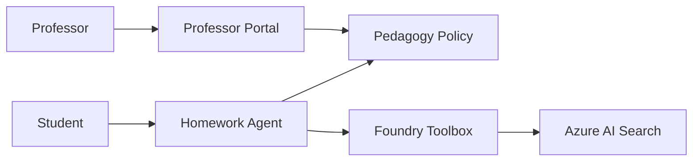

# Architecture overview

The accelerator uses a simple hosted-agent pattern:

The professor portal updates policy and knowledge source configuration without redeploying the agent. The agent reads the policy at runtime and uses the toolbox endpoint to access search-backed knowledge.
