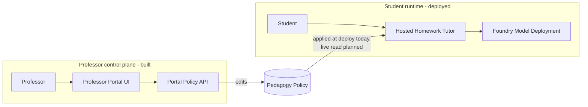
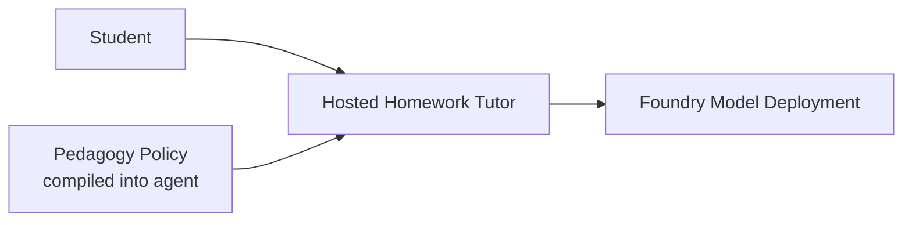
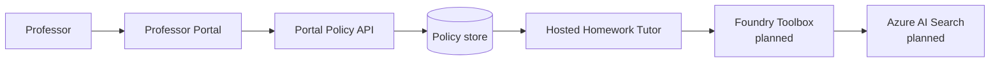
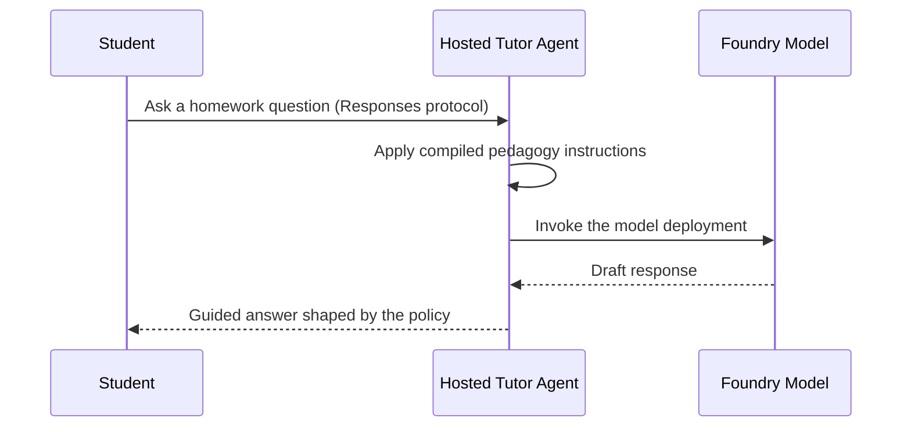

# Architecture overview

The accelerator has two halves that together deliver its core promise — **professor-owned pedagogy for a student-facing tutor**:

- a **hosted tutor agent** on Microsoft Foundry that answers homework questions, and
- a **professor portal** where educators tune the pedagogy policy that shapes those answers.

> **Integration status.** Both halves are built. The hosted tutor + its Foundry model deployment are **deployed and verified**. The professor portal is **fully implemented** (UI + policy API) and runs locally, but it is **not yet connected to the live hosted agent** — today the policy it edits is applied to the agent at deploy time rather than read live. The Azure AI Search **toolbox** is defined but not yet connected. Sections below mark each piece.

## The two halves

The professor edits the pedagogy policy in the portal; that policy governs how much help the tutor offers. Today the policy is applied to the agent at deploy time; the planned step is a live read so portal saves take effect without a redeploy.

## System at a glance (deployed today)

The tutor runs as a hosted Foundry agent. Its instructions — including the pedagogy policy — are baked into the container image when it is deployed. To change tutoring behavior, a professor edits the policy (in the portal or the file) and the agent is **redeployed**.

## Planned extension

The intended end state connects the portal's policy store to the agent for a **live** per-request read, plus a Foundry Toolbox that grounds answers in Azure AI Search. Reaching a live policy read requires a Foundry connection or Standard Agent Setup (capability host); a plain blob read from the hosted container is blocked by the agent's managed-identity permissions in this environment.

## Core components

| Component | Status | Responsibility | Source |
| --- | --- | --- | --- |
| Hosted tutor agent | **Deployed** | Runs on Foundry; answers under the pedagogy policy | [../foundry-tutor/hello-world-dotnet-agent-framework/src/hello-world-dotnet-agent-framework/Program.cs](../foundry-tutor/hello-world-dotnet-agent-framework/src/hello-world-dotnet-agent-framework/Program.cs) |
| Agent + model manifest | **Deployed** | Declares the agent, model deployment, and env vars | [../foundry-tutor/hello-world-dotnet-agent-framework/azure.yaml](../foundry-tutor/hello-world-dotnet-agent-framework/azure.yaml) |
| Professor Portal UI | **Built** | Lets professors tune help level, steps, direct answers, and citations | [../ui/app/src/App.jsx](../ui/app/src/App.jsx) |
| Portal Policy API | **Built** | Reads and writes the pedagogy policy | [../ui/api/index.js](../ui/api/index.js) |
| Pedagogy policy | **Deployed (applied at deploy)** | The rules the tutor follows; the shared contract between portal and agent | [../src/HomeworkAgent/Pedagogy/pedagogy-policy.json](../src/HomeworkAgent/Pedagogy/pedagogy-policy.json) |
| Foundry Toolbox | Planned | Curated Azure AI Search knowledge access | [../toolbox/toolbox.yaml](../toolbox/toolbox.yaml) |

## Professor portal

The portal is the control plane of the accelerator — the surface where the "professor-owned pedagogy" promise actually lives. It is implemented today as:

- a **React UI** ([../ui/app/src/App.jsx](../ui/app/src/App.jsx)) with controls for help style, maximum steps revealed, direct-answer toggle, and citation requirement, and
- a **policy API** ([../ui/api/index.js](../ui/api/index.js)) that reads the current policy on load and writes edits back via `GET`/`POST /api/policy`.

The UI and API already round-trip the same pedagogy policy document that the tutor uses, so the professor experience is real and testable locally. The single remaining integration step is connecting the policy the portal writes to the **deployed** agent for a live read — which is the "planned extension" above. Until then, a professor's saved changes are applied to the tutor by redeploying the agent.

## Request flow (deployed today)

1. **Invoke.** A caller sends a message to the agent's Responses endpoint (for example via `azd ai agent invoke`).
2. **Apply policy.** The agent's instructions — carrying the pedagogy guardrails compiled in at deploy time — shape the model call.
3. **Answer.** The tutor returns a guided response: hints and steps rather than a direct solution to graded work.

## Pedagogy as configuration

The policy is a small, declarative JSON document. It expresses:

- **helpLevel** — `hint_only`, `guided`, `worked_example`, or `full_solution`
- **maxStepsRevealed** — how much of a solution the tutor may expose at once
- **allowDirectAnswers** — whether a direct solution is ever permitted
- **citationsRequired** — whether responses must cite sources
- **subjectOverrides** — per-subject adjustments

Today this policy is folded into the agent's instructions at deploy time, so changing it means editing the policy and **redeploying** the agent. The planned portal + connection design would let professors change it without a redeploy. See the [configuration guide](configuration.md) for the full schema.

## Knowledge access through the toolbox (planned)

The Foundry Toolbox is the intended boundary between the tutor and course knowledge: it would define which Azure AI Search indexes are in scope and how they are queried. It is defined in [../toolbox/toolbox.yaml](../toolbox/toolbox.yaml) but is **not yet connected** to the deployed agent.

## Deployment topology

- The tutor is deployed as a **hosted Foundry agent** (not a self-managed container) via Azure Developer CLI.
- A Foundry **model deployment** backs the agent.
- The professor portal (static web app + API) is scaffolding and is not part of the current deploy.

See [../scripts/deploy.ps1](../scripts/deploy.ps1) or [../scripts/deploy.sh](../scripts/deploy.sh) for the deployment entry points.

## Design principles

- **Pedagogy is explicit.** The tutor's limits live in a policy, not scattered through prose.
- **Foundry hosts the runtime.** Auth, scaling, and the model call are managed by Foundry, not hand-rolled.
- **Extend through governed boundaries.** Knowledge access is intended to flow through a toolbox/connection, keeping sources approved and auditable.
- **Be honest about state.** Deployed pieces and planned pieces are labeled so operators know what actually runs.
