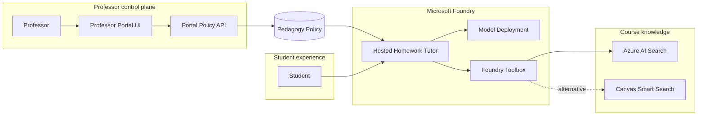
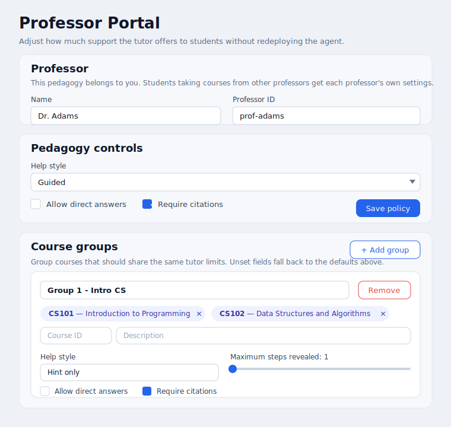
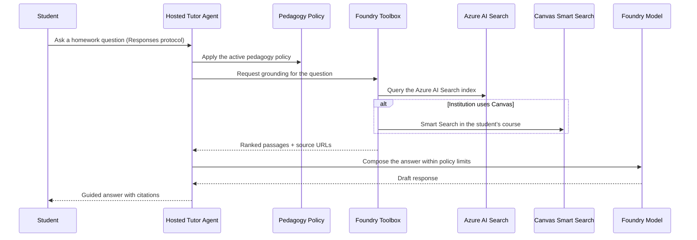

# Architecture overview

The accelerator delivers one core promise — **professor-owned pedagogy for a student-facing tutor** — through three cooperating parts:

- a **hosted tutor agent** on Microsoft Foundry that answers homework questions,
- a **professor portal** where educators tune the pedagogy policy that shapes those answers, and
- a **knowledge layer** that grounds answers in real course content, defaulting to Azure AI Search with Canvas Smart Search as an alternative source.

## System architecture



A professor sets the pedagogy policy in the portal. A student asks a question; the tutor applies that policy to decide how much help to give, pulls grounding content from the course knowledge layer through the Foundry Toolbox, and returns a guided answer with citations.

## Core components

| Component | Responsibility | Source |
| --- | --- | --- |
| Hosted tutor agent | Runs on Foundry; answers questions under the pedagogy policy and grounds them through the toolbox | [../foundry-tutor/hello-world-dotnet-agent-framework/src/hello-world-dotnet-agent-framework/Program.cs](../foundry-tutor/hello-world-dotnet-agent-framework/src/hello-world-dotnet-agent-framework/Program.cs) |
| Agent + model manifest | Declares the agent, model deployment, and environment | [../foundry-tutor/hello-world-dotnet-agent-framework/azure.yaml](../foundry-tutor/hello-world-dotnet-agent-framework/azure.yaml) |
| Professor Portal UI | Lets professors tune help level, steps, direct answers, and citations | [../ui/app/src/App.jsx](../ui/app/src/App.jsx) |
| Portal Policy API | Reads and writes the pedagogy policy | [../ui/api/index.js](../ui/api/index.js) |
| Pedagogy policy | The rules the tutor follows; the shared contract between portal and agent | [../src/HomeworkAgent/Pedagogy/pedagogy-policy.json](../src/HomeworkAgent/Pedagogy/pedagogy-policy.json) |
| Foundry Toolbox | Curated boundary to course knowledge (Azure AI Search; Canvas Smart Search) | [../toolbox/toolbox.yaml](../toolbox/toolbox.yaml) |

## The three planes

- **Student runtime** — the hosted agent and its model deployment. It answers questions and is stateless per request.
- **Professor control plane** — the portal and its policy API. It owns the pedagogy policy that governs tutoring behavior.
- **Knowledge layer** — the toolbox and the course-content sources it fronts. It keeps the tutor's answers grounded in approved material.

Keeping these separate is what lets professors change tutoring behavior and knowledge scope without rewriting the agent.

## Professor portal

The portal is where the "professor-owned pedagogy" promise lives:

- a **React UI** ([../ui/app/src/App.jsx](../ui/app/src/App.jsx)) with controls for professor identity, help style, maximum steps revealed, direct-answer toggle, citation requirement, and **course groups**, and
- a **policy API** ([../ui/api/index.js](../ui/api/index.js)) that reads the current policy on load and writes edits back via `GET`/`POST /api/policy`.

The UI and API round-trip the same pedagogy policy document the tutor consumes, so a professor's edits flow into the tutor's behavior. Here is the portal, showing the professor identity and a course group:



*(The image above is a rendered mockup of the portal UI. A live, interactive version is at [portal-preview.html](portal-preview.html).)*

## Pedagogy as configuration

The policy is a small, declarative JSON document:

- **professorId / professorName** — the professor who owns this pedagogy
- **helpLevel** — `hint_only`, `guided`, `worked_example`, or `full_solution`
- **maxStepsRevealed** — how much of a solution the tutor may expose at once
- **allowDirectAnswers** — whether a direct solution is ever permitted
- **citationsRequired** — whether responses must cite sources
- **subjectOverrides** — per-subject adjustments layered on the defaults
- **courseGroups** — named groups of courses (each with an ID and description) that share one set of limits

Because a student can take courses from multiple professors, the tutor resolves the pedagogy from whichever professor **owns** the course being asked about, then applies that professor's course-group limits. See the [configuration guide](configuration.md) for the full schema.

> **Planned:** To resolve the right professor's pedagogy automatically, we will need to add a connection to the student's source of schedule/enrollment (for example the LMS/SIS or Canvas enrollments API). Grounding on the student's actual course roster lets the tutor map the current question to the correct professor's courses instead of relying on a manually supplied course ID.

Because the tutor reads this policy rather than hardcoding it, the same deployed agent behaves differently across courses and assignments. See the [configuration guide](configuration.md) for the full schema.

## Knowledge access

The Foundry Toolbox is the single, curated boundary between the tutor and course knowledge. It fronts two sources.

### Azure AI Search (default)

The default knowledge source is an **Azure AI Search** index. Course material is ingested into the index (for example with vector semantic hybrid retrieval), and the toolbox queries it for relevant passages. This path is portable across any LMS or content source, gives full control over what is indexed and how it is ranked, and keeps the knowledge boundary inside Azure alongside the rest of the accelerator.

Adding or updating a knowledge source is an index/toolbox change — not an agent change — which keeps knowledge governance with the people who own the content.

### Canvas Smart Search (alternative)

For institutions on Canvas, the toolbox can instead query Canvas's built-in meaning-based search over a course's own content:

```text
GET /api/v1/courses/:course_id/smartsearch?q=<query>
```

It returns ranked `SearchResult` objects — each with `content_id`, `content_type` (for example `WikiPage`), `title`, `body`, `html_url`, and a `distance` score where smaller is a closer match. Because results carry the Canvas URL, the tutor can cite the exact page a fact came from, and there is no separate ingestion pipeline — the content is already indexed by Canvas.

> **Caveat:** Canvas Smart Search is a **beta** API with limited availability, and Instructure notes there may be breaking changes before its final release. Other major LMS platforms do not currently offer an equivalent built-in semantic search, so this alternative is Canvas-specific.

Because both sources sit behind one toolbox, the tutor's grounding logic does not change based on the source: it asks the toolbox for relevant passages, and the toolbox decides whether those come from Azure AI Search or Canvas.

## Request flow



1. **Apply policy.** The agent reads the active pedagogy policy to decide how much help to offer.
2. **Ground.** The toolbox retrieves relevant course content — Azure AI Search by default, or Canvas Smart Search where the institution uses Canvas.
3. **Compose.** The model produces an answer that honors the policy's help level, step limits, and citation requirements.
4. **Answer.** The tutor returns hints and guided steps (not a direct solution to graded work) with citations back to the source.

## Deployment topology

- The tutor is deployed as a **hosted Foundry agent** via Azure Developer CLI, backed by a Foundry **model deployment**.
- The **professor portal** runs as a static web app with a lightweight policy API.
- The **knowledge layer** connects the toolbox to an Azure AI Search index by default, with Canvas Smart Search as an alternative source.

See [../scripts/deploy.ps1](../scripts/deploy.ps1) or [../scripts/deploy.sh](../scripts/deploy.sh) for the deployment entry points.

## Design principles

- **Pedagogy is explicit.** The tutor's limits live in a policy the professor owns, not scattered through prose.
- **Foundry hosts the runtime.** Auth, scaling, and the model call are managed by Foundry.
- **Own the knowledge boundary.** Default to an Azure AI Search index for portable, governed retrieval; use the LMS's own search where it fits.
- **Extend through governed boundaries.** All knowledge flows through the toolbox, keeping sources approved, auditable, and swappable.
