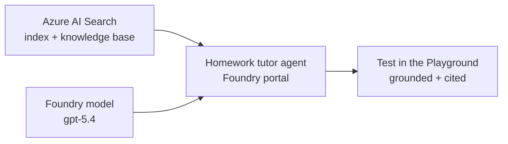

# Getting started: Build a grounded homework tutor on Microsoft Foundry

In this lab you stand up a **student homework tutor** on Microsoft Foundry and
ground it in your own course material through **Azure AI Search**. You'll do the
interesting parts — creating the agent and connecting it to knowledge —
**click-by-click in the Foundry portal**, so you leave knowing how the pieces fit,
not just how to run a script.

**Audience:** mixed skill — some Azure familiarity helps, but every step is
spelled out. **Time:** ~2–3 hours.

## What you'll build



You'll go through four steps:

| Step | You do | Where |
| --- | --- | --- |
| 1. Deploy infrastructure | Run one deploy script | Terminal |
| 2. Deploy knowledge data | Run one setup script | Terminal |
| 3. Create the agent | Click through the portal | Foundry portal |
| 4. Link the agent to knowledge | Click through the portal | Foundry portal |

> **LTI / LMS launch is out of scope for this lab.** In production, students launch
> the tutor from your LMS (Canvas, Blackboard, Moodle…) over **LTI 1.3**, and the
> tool routes by role and proxies to this same agent. That layer is covered
> separately in [lti-integration.md](lti-integration.md) — here we focus on the
> agent and its grounding.

---

## Prerequisites

Before you start, make sure you have:

- **An Azure subscription** where you can create resources **and role
  assignments**. The infrastructure template grants RBAC between Azure AI Search
  and Foundry, so you need **Owner**, or **Contributor + User Access
  Administrator**, on the subscription.
- **Model quota** for `gpt-5.4` and `gpt-5.4-mini` in your region.
  **northcentralus** is the tested default. (Check with
  `az cognitiveservices usage list -l northcentralus`.)
- **Azure CLI** — `az login` and select the right subscription:
  ```powershell
  az login
  az account set --subscription "<your-subscription-id>"
  ```
- **Azure Developer CLI (azd) 1.28+** — `azd auth login`. Step 1 provisions the
  infrastructure through a dedicated azd environment.
- **PowerShell 7+** (the scripts are `.ps1`; a `deploy.sh` bash equivalent is also
  provided for step 1).
- **This repository**, cloned locally, with your terminal in the repo root.

Pick a short **environment name** (letters/numbers, e.g. `eduhw01`). It becomes
the **azd environment** name and drives all resource names: the resource group is
`rg-eduhw01`, the Foundry account `aif-eduhw01`, the search service `srch-eduhw01`,
and so on. Use it consistently.

```powershell
$env:LAB = "eduhw01"   # your environment name — reuse it in every step
```

---

## Step 1 — Deploy the infrastructure

This provisions the **slim lab stack**: a Foundry (Azure AI Services) account and
project, two model deployments (`gpt-5.4` for the tutor, `gpt-5.4-mini` for
knowledge-base reasoning), and an **Azure AI Search** service — plus the RBAC and
project connection that make portal grounding work later.

The deploy script creates a **new azd environment** for you, sets the
subscription/region, and runs `azd provision`:

```powershell
./lab/deploy.ps1 -EnvironmentName $env:LAB
```

<details>
<summary>Prefer bash?</summary>

```bash
./lab/deploy.sh eduhw01
```
</details>

It provisions a subscription-scoped deployment that creates `rg-<env>` and
everything inside it. Give it a few minutes. When it finishes it prints the values
you'll need next — **copy the `project endpoint`**, it looks like:

```
project endpoint : https://aif-eduhw01.services.ai.azure.com/api/projects/homework
```

### What just got created

| Resource | Name | Why |
| --- | --- | --- |
| Foundry account | `aif-<env>` | Hosts the project + models |
| Foundry project | `homework` | Where your agent lives |
| Model deployment | `gpt-5.4` | The tutor's chat model |
| Model deployment | `gpt-5.4-mini` | Knowledge-base query planning / answer synthesis |
| Azure AI Search | `srch-<env>` | Stores + retrieves course material |
| RBAC + connection | — | Lets the agent read the search index and the search service call the model |

### Verify

1. Open the [Azure portal](https://portal.azure.com) → resource group `rg-<env>`.
   You should see the Foundry account and the search service.
2. Open the [Foundry portal](https://ai.azure.com) → your project `homework`.
   Under **Models + endpoints** you should see `gpt-5.4` and `gpt-5.4-mini`
   deployed.

> **Deploy failed on quota?** Change region or request quota, then re-run — the
> deploy is idempotent. **Failed on role assignment?** Your account lacks
> permission to grant RBAC; ask for Owner / User Access Administrator on the
> subscription.

---

## Step 2 — Deploy the knowledge data

The search service is empty. This step creates the **index**, a **knowledge
source** over it, and a **knowledge base** (the thing the agent will query), then
loads seed course material — a small set of dummy **microbiology** documents so
you have something to ground on out of the box.

```powershell
./scripts/setup-knowledge-base.ps1 -EnvironmentName $env:LAB
```

The script auto-discovers the search service and Foundry account in `rg-<env>`,
so you don't pass endpoints. It's idempotent — safe to re-run.

### What it creates

- **Index** `course-materials` — fields `id, title, content, subject, url`, with a
  semantic ranker configuration.
- **Knowledge source** `course-materials-source` — points the knowledge base at
  that index.
- **Knowledge base** `course-knowledge-base` — what the agent retrieves from; uses
  `gpt-5.4-mini` for query planning and answer synthesis.
- **Seed documents** from [scripts/seed-data/microbiology.json](https://github.com/dbruun/edu-cohort-homework/blob/main/scripts/seed-data/microbiology.json).

### Use your own course material (optional)

Edit [scripts/seed-data/microbiology.json](https://github.com/dbruun/edu-cohort-homework/blob/main/scripts/seed-data/microbiology.json)
— each entry is `{ "id", "title", "content", "subject", "url" }` — or point at your
own file and re-run:

```powershell
./scripts/setup-knowledge-base.ps1 -EnvironmentName $env:LAB -SeedDataPath ./my-course.json
```

Every answer the tutor later gives is retrieved from, and cites, these documents.

### Verify

In the Foundry portal → your project → **Knowledge bases** (or **Search** service
in the Azure portal → **Indexes**), confirm `course-knowledge-base` and the
`course-materials` index exist and the index reports a document count > 0.

---

## Step 3 — Create the agent (Foundry portal)

Now the fun part. You'll create the tutor **in the portal** so you can see how an
agent is defined.

1. Go to the [Foundry portal](https://ai.azure.com) and open your project
   `homework`.
2. In the left nav, open **Agents**, then **+ New agent** (or **+ Create**).
3. Configure it:
   - **Name:** `homework-tutor`
   - **Model / deployment:** `gpt-5.4`
  - **Instructions:** open [lab/agent-instructions.md](https://github.com/dbruun/edu-cohort-homework/blob/main/lab/agent-instructions.md)
     and paste the instructions block into the **Instructions** (system prompt)
     box.
4. **Save** / **Create**.

### Test it — ungrounded, on purpose

Open the agent's **Playground** (test pane) and ask a course question:

> How do bacteria resist antibiotics?

Because you **haven't attached the knowledge base yet**, the agent has nothing
approved to retrieve from. Following its instructions, it should say the course
material doesn't cover the topic (or refuse to cite). **This is expected** — you're
about to fix it in Step 4, and the contrast is the point.

> **Fallback (if you can't use the portal):** you can create the same agent from a
> script — see [scripts/create-foundry-agent.py](https://github.com/dbruun/edu-cohort-homework/blob/main/scripts/create-foundry-agent.py).
> Set `PROJECT_ENDPOINT` to the endpoint from Step 1 and run it. But do Step 4's
> linking in the portal to get the full experience.

---

## Step 4 — Link the agent to the knowledge

Give the tutor its course material.

1. Still in the **Agents** view, open your `homework-tutor` agent.
2. Find the **Knowledge** section (may be labeled **Knowledge**, **Knowledge
   bases**, or **Add knowledge**).
3. **+ Add** → choose **Azure AI Search** / **Knowledge base**.
4. Select the knowledge base **`course-knowledge-base`** (you may be asked to pick
   the connection **`course-knowledge-connection`**, which the infrastructure
   already created for you).
5. **Save** the agent.

Behind the scenes, the portal wires the knowledge base to the agent as a retrieval
tool and uses the **project's managed identity** to read the search index — and
the infrastructure in Step 1 already granted that identity permission, so it just
works.

### Test it — now grounded

Back in the **Playground**, ask the same question:

> How do bacteria resist antibiotics?

This time the tutor **retrieves from the seeded course material** and answers from
it, with citation markers pointing at the source documents — and it still tutors
(hints and guidance, not a full graded-work solution) per the instructions. Try a
question the material **doesn't** cover (e.g. *"Explain the French Revolution"*) and
watch it decline rather than make something up.

> **Not grounded / permission error?** Azure AI Search data-plane RBAC can take a
> few minutes to propagate after Step 1. Wait ~5 minutes and retry. Confirm the
> knowledge base shows documents (Step 2 verify) and that you selected
> `course-knowledge-base`, not an empty index.

You now have a working, grounded homework tutor. 🎓

---

## Clean up

When you're done, delete everything by removing the resource group:

```powershell
az group delete --name "rg-$($env:LAB -replace '-','')" --yes --no-wait
```

That removes the Foundry account, models, search service, and all role
assignments created by the lab. (The knowledge base and index live inside the
search service, so they go too.)

---

## Where LTI fits (for the walkthrough / slides)

This lab stopped at the agent, tested in the Foundry Playground. In a real course,
the missing layer is
**LMS launch**:

- A student clicks the tutor **inside a course in the LMS**.
- The LMS performs an **LTI 1.3** launch, passing signed identity, role
  (learner vs. instructor), and course context.
- An **LTI tool** validates the launch, routes the learner to the chat UI and the
  instructor to a policy/portal view, and proxies to **this same agent** — with the
  agent kept private behind the tool's managed identity instead of exposed to the
  browser.

The repository contains an LTI tool implementation and supporting documentation
(see `lti-tool/`, [lti-integration.md](lti-integration.md), and
[lti-configuration.md](lti-configuration.md)), but its container infrastructure
is intentionally not part of the current hands-on flow.

---

## Troubleshooting quick reference

| Symptom | Likely cause | Fix |
| --- | --- | --- |
| Deploy fails creating role assignments | Not Owner / User Access Administrator | Get the role, or have an admin run Step 1 |
| Deploy fails on model | No `gpt-5.4` / `gpt-5.4-mini` quota in region | Change region or request quota, re-run |
| Agent answers "not covered" after Step 4 | Knowledge base empty, or wrong KB selected | Re-run Step 2; confirm you picked `course-knowledge-base` |
| Playground grounding permission error | Search RBAC still propagating | Wait ~5 min, retry |
