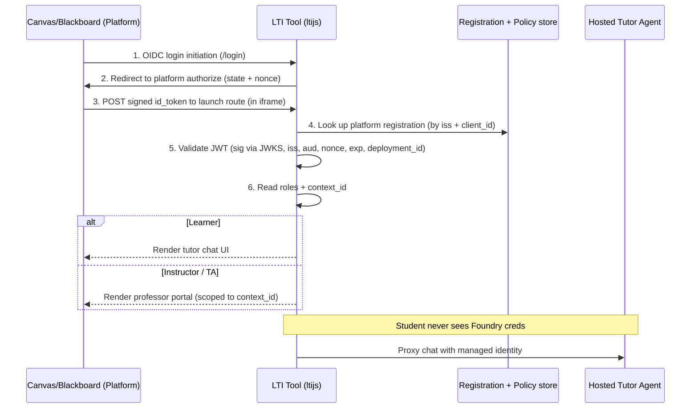
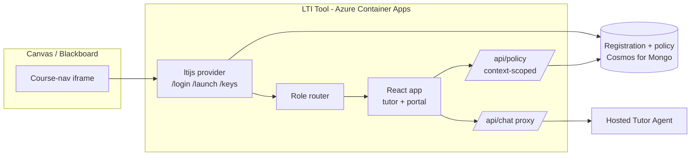

# LTI integration design — surfacing the tutor in Canvas & Blackboard

**Status: later-phase scaffold exists.** A thin ltijs tool (OIDC login, launch validation, role routing) lives in [lti-tool](https://github.com/dbruun/edu-cohort-homework/tree/main/lti-tool), but its container infrastructure is not part of the current lab. Tutor chat and portal UI are still stubbed. This document proposes how to embed the student tutor (and the professor portal) directly inside Canvas and Blackboard using **LTI 1.3 / LTI Advantage**, built with the Node **ltijs** library so a single tool serves both LMS platforms.

> For deployment, registration, environment variables, and a step‑by‑step **test‑launch** walkthrough (a real LTI 1.3 launch has been proven against the 1EdTech Reference Implementation), see [lti-configuration.md](lti-configuration.md).

## Goal

A student opens their course in Canvas or Blackboard, clicks a course-navigation link, and the homework tutor chat appears **inside the LMS** — already knowing who they are and which course they're in, with no separate login. An instructor clicking the same link lands in the **professor portal** to tune pedagogy for *that course*.

## Why LTI 1.3 (not 1.1)

- Both Canvas and Blackboard support **LTI 1.3 / LTI Advantage**. LTI 1.1 is OAuth-1-signed and deprecated — do not build it.
- LTI 1.3 is **OpenID Connect + OAuth 2.0 + signed JWTs**. The launch delivers a signed `id_token` containing the user id (`sub`), the course context, the user's **roles**, the resource link, and any custom parameters.
- One correctly-built generic LTI 1.3 tool registers against **any** conformant platform — so "Canvas and Blackboard from one codebase" is the standard's design goal, not a workaround.

## Launch flow

ltijs auto-exposes the `/login`, launch, and JWKS (`/keys`) endpoints, and validates the `id_token` (signature, `iss`, `aud`, `nonce` replay, `exp`, `deployment_id`) before your handler ever runs.

## How this maps onto the existing repo

The LTI **roles claim** lines up with the student/professor split this accelerator already has, so **one tool renders both experiences**:

| LTI role (membership) | Experience |
| --- | --- |
| `#Learner` | Tutor chat |
| `#Instructor`, `#TeachingAssistant`, `#ContentDeveloper` | Professor portal ([ui/app/src/App.jsx](https://github.com/dbruun/edu-cohort-homework/blob/main/ui/app/src/App.jsx)) |
| Unknown / other | Deny, or read-only student view |

The LTI **`context_id`** (course) becomes the key for pedagogy policy. Today the policy is a single deploy-time document ([src/HomeworkAgent/Pedagogy/pedagogy-policy.json](https://github.com/dbruun/edu-cohort-homework/blob/main/src/HomeworkAgent/Pedagogy/pedagogy-policy.json)); LTI lets it become **per-course** (`policy[deployment_id + context_id]`) and read **live** on each chat — which is exactly the "live policy read" extension [architecture.md](architecture.md) marks as planned. LTI is what finally makes that extension worth building.

## Proposed components

| Component | New? | Responsibility |
| --- | --- | --- |
| **ltijs provider** | new | OIDC login, launch validation, JWKS, deep linking, NRPS/AGS |
| **Registration + policy store** | new | Platform registrations, nonces/state, per-course policy — Cosmos DB for MongoDB (ltijs native) or Postgres via `ltijs-sequelize` |
| **Role router** | new | Route Learner → chat, Instructor → portal |
| **Context-scoped policy API** | evolve [ui/api/index.js](https://github.com/dbruun/edu-cohort-homework/blob/main/ui/api/index.js) | `GET/POST /api/policy` keyed by `context_id` |
| **Chat proxy** | new | Server-side call to the Foundry agent with **managed identity** — replaces the `demo-token` stub in [src/HomeworkAgent/Program.cs](https://github.com/dbruun/edu-cohort-homework/blob/main/src/HomeworkAgent/Program.cs) |
| **React app** | reuse [ui/app](https://github.com/dbruun/edu-cohort-homework/tree/main/ui/app) | Same UI, now rendered behind an LTI launch |

## Registration (generic, both platforms)

Prefer **LTI Dynamic Registration** (ltijs `DynamicRegistration`) — Canvas and Blackboard both support it, so an admin pastes one registration URL and the tool self-configures. Fall back to manual registration where dynamic isn't allowed.

**What the tool publishes (same for both):**
- OIDC login initiation URL — `https://<tool-host>/login`
- Launch / target link URI — `https://<tool-host>/lti/launch`
- Public JWKS URL — `https://<tool-host>/keys`
- Requested LTI Advantage scopes (AGS, NRPS) if used

**What each platform returns (stored per registration):** `client_id`, `deployment_id`, platform authorize endpoint, access-token endpoint, platform JWKS URL — registered via `lti.registerPlatform(...)`.

- **Canvas:** create a *Developer Key → LTI Key* (JSON config or manual), enable placements such as `course_navigation` (and `assignment_selection` for Deep Linking), note the `deployment_id`.
- **Blackboard:** register the app in the Developer Portal to get the Application/`client_id`; the institution admin registers the LTI 1.3 tool with that client id. Blackboard's OIDC/token/JWKS endpoints are fixed per cloud.

## The gotchas that actually bite

1. **iframe embedding.** The LMS renders the tool in an iframe. Do **not** send `X-Frame-Options: DENY`; set `Content-Security-Policy: frame-ancestors` to the registered LMS domains. The current [ui/staticwebapp.config.json](https://github.com/dbruun/edu-cohort-homework/blob/main/ui/staticwebapp.config.json) sets no headers and would block framing.
2. **Third-party cookies.** Browsers partition/block them in iframes. Configure ltijs cookies `secure: true, sameSite: 'None'`, and rely on ltijs's built-in **LTI platform `postMessage` storage** fallback so launches survive Safari/Chrome cookie restrictions. Avoid cookie-only sessions for OIDC state/nonce.
3. **Don't hand-roll JWT/JWKS/OIDC** — let ltijs do signature, nonce-replay, and claim validation.
4. **Auth boundary.** Students never receive Foundry credentials. The LTI backend is the trust boundary and calls the agent with a managed identity (replacing `demo-token`).
5. **Persistent host + stable URL.** LTI needs fixed public HTTPS endpoints and a live JWKS, plus a database for ltijs. Use **Azure Container Apps** or App Service — **not** Static Web Apps or a consumption-plan Function.

## Security checklist (OWASP + LTI)

- JWT validation: signature via platform JWKS, plus `iss`, `aud` = `client_id`, `exp`, one-time `nonce`, `deployment_id` (ltijs enforces these).
- `frame-ancestors` limited to registered LMS domains; no `X-Frame-Options: DENY`.
- Store platform secrets and Foundry credentials in Key Vault / Container Apps secrets, never in the client.
- Treat the roles claim as the authorization gate for the portal; default-deny unknown roles.
- LTI carries PII (name, email) — decide what is stored vs. used transiently; edu deployments have FERPA implications.
- Rate-limit the chat proxy per authenticated LTI user/course.

## Infra & deployment changes

- Add a second service to [azure.yaml](https://github.com/dbruun/edu-cohort-homework/blob/main/azure.yaml) — the ltijs tool as a `containerapp`.
- Provision a datastore in future infrastructure — Cosmos DB for MongoDB (ltijs native) or Postgres.
- Keep the tutor as a hosted Foundry agent; the proxy reaches it with managed identity.
- Publish the tool's public HTTPS + `/keys` before registering with either LMS.

## Optional LTI Advantage services (later)

- **Deep Linking** — instructor chooses which course/knowledge-source the tutor attaches to when placing the link.
- **Names & Role Provisioning (NRPS)** — pull the course roster.
- **Assignment & Grade Services (AGS)** — write engagement/completion back into the gradebook.

## Phased plan

1. **Launch + role routing.** ltijs provider, one registration (Canvas *or* Blackboard), validate `id_token`, render tutor vs. portal by role. Prove framing + cookie survival.
2. **Context-scoped live policy.** Move policy to the store keyed by `context_id`; portal writes, chat reads live per request. Retire deploy-time-only policy.
3. **Chat proxy with managed identity.** Replace `demo-token`; wire the tutor to the real Foundry agent.
4. **Second platform + Dynamic Registration.** Add the other LMS; enable self-registration.
5. **Advantage services.** Deep Linking, NRPS, AGS as needed.

## Open questions

- Dynamic Registration everywhere, or manual for institutions that disallow it?
- Cosmos (Mongo API) vs. Postgres for the ltijs store?
- Does policy live in the ltijs store, or stay in the agent repo and get read over an API?
- Is grade/engagement passback (AGS) in scope, or is in-LMS chat enough for v1?
