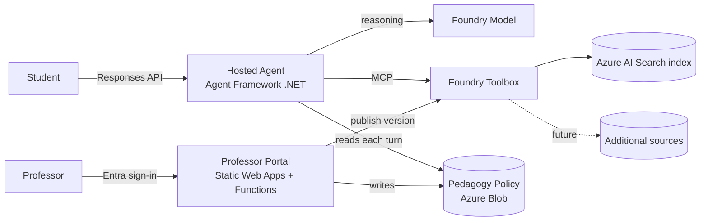

# Plan: EDU Homework Agent Accelerator (Foundry Hosted Agent)

## Decisions (locked)
- Agent purpose: **Student-facing tutor** (grounded homework help)
- Runtime: **.NET / C# (Microsoft Agent Framework)**, entry point MyAgent.dll, runtime dotnet_10
- Docs site: **Jekyll** on GitHub Pages (Markdown + Mermaid, no build step beyond Pages)
- Execution scope: **Build repo artifacts only first** — no live azd provision/deploy yet
- Knowledge: connect to **Azure AI Search via Foundry Toolbox** (MCP endpoint), configurable to add more indexes/sources without redeploying the agent
- **Professor-configurable pedagogy limits** — control how far the agent goes (hint-only → guided → full solution), changeable without redeploying
- **Friendly professor UI** (no code) — Azure Static Web Apps (React) + Functions API, Entra ID auth (role-gated). UI does: (a) edit pedagogy limits, (b) manage knowledge sources (add/remove AI Search indexes, publish new toolbox version). Policy stored in **Azure Blob Storage** (JSON), agent reads each turn.

## Architecture summary
- Hosted agent (container, Responses protocol) built with Agent Framework .NET
- Agent connects to ONE Foundry Toolbox MCP endpoint (TOOLBOX_ENDPOINT env var)
- Toolbox holds Azure AI Search tool(s); add/replace indexes = publish new toolbox version, NO agent redeploy
- Pedagogy policy stored in Azure Blob Storage (JSON), read by agent each turn; written by professor UI. No redeploy to change limits.
- Professor UI = Azure Static Web Apps (React SPA) + Functions API backend, Entra ID auth. Backend calls Foundry SDK to publish toolbox versions and writes policy blob.
- azure.yaml declares: ai-project service, azure.ai.toolbox service, azure.ai.agent service wired with uses:/toolboxes:
- Docs (Jekyll) explain what the accelerator is, how to use, config, with Mermaid flow diagram

## Repo layout (to create)
- /README.md — accelerator overview + quickstart
- /azure.yaml — azd services: ai-project, toolbox, hosted agent
- /infra/ — (placeholder) bicep params referenced by azd (generated by azd ai agent init later)
- /src/HomeworkAgent/ — .NET Agent Framework project
  - HomeworkAgent.csproj
  - Program.cs — MCPStreamableHTTP tool wired to TOOLBOX_ENDPOINT; ResponsesAgentServerHost
  - Pedagogy/PedagogyPolicy.cs — model + loader (help levels, thresholds, allow/deny behaviors)
  - Pedagogy/pedagogy-policy.json — default policy (professor-editable)
  - instructions/tutor-system-prompt.md — base system prompt, composes with policy
  - .env.example — FOUNDRY_PROJECT_ENDPOINT, TOOLBOX_ENDPOINT, AZURE_AI_MODEL_DEPLOYMENT_NAME, PEDAGOGY_POLICY_URI
  - .agentignore
- /toolbox/toolbox.yaml — Azure AI Search tool config, placeholder connection + index; documented "add another source" pattern
- /config/knowledge-sources.md — how to register a new AI Search connection + add to toolbox version
- /ui/ — **Professor portal (Azure Static Web Apps)**
  - /ui/app/ — React SPA: pedagogy limits form (sliders/toggles), knowledge-sources manager, Entra ID sign-in (MSAL)
  - /ui/api/ — Functions (.NET or TS) API: GET/PUT policy blob, list/add/remove AI Search sources, publish toolbox version; Entra token validation + professor role check
  - /ui/staticwebapp.config.json — routes, auth (Entra), role-gated /admin
- /docs/ (Jekyll) — _config.yml, index.md, how-to-use.md, configuration.md (incl. pedagogy limits + how to use the UI), architecture.md (Mermaid), Gemfile
- /.github/workflows/pages.yml — GitHub Pages deploy (if needed beyond native)
- /AGENTS.md — marker so future prompts reload microsoft-foundry skill

## Pedagogy policy design (professor-configurable)
- pedagogy-policy.json schema:
  - helpLevel: "hint_only" | "guided" | "worked_example" | "full_solution"
  - maxStepsRevealed: int
  - allowDirectAnswers: bool (e.g., false for graded homework)
  - subjectOverrides: map subject -> helpLevel
  - refusalMessage / escalationMessage strings
  - citationsRequired: bool (must cite AI Search sources)
- Loader reads policy JSON from **Azure Blob Storage** (PEDAGOGY_POLICY_URI → blob). Professor UI writes the blob; agent reads latest each turn. No redeploy.
- Optional Foundry Guardrail (RAI policy) attached to toolbox version for content safety (separate from pedagogy).

## Professor UI design (no-code portal)
- Stack: Azure Static Web Apps (React SPA) + managed Functions API; Entra ID auth built into SWA; role "professor" gates /admin routes.
- Pedagogy tab: friendly controls (help-level radio/slider, toggles for direct answers & citations, steps-revealed number, per-subject overrides table). Save → API PUTs policy JSON to Blob.
- Knowledge Sources tab: list current AI Search indexes in the toolbox; add source (index name + connection picker), remove source; "Publish" → API calls Foundry SDK create_toolbox_version + promote default. Agent picks it up with no redeploy.
- API auth: validates Entra token + professor role/group before any write; uses managed identity to reach Blob + Foundry project.
- Preview (optional, deferred): call agent Responses endpoint to test current settings.

## Steps
### Phase 1 — Agent code (.NET)
1. Scaffold HomeworkAgent.csproj referencing Agent Framework + MCP client + Azure.Identity
2. Program.cs: DefaultAzureCredential -> bearer token httpx-equiv auth -> MCPStreamableHTTP tool to TOOLBOX_ENDPOINT; disable ping/prompts-list (known MAF toolbox gotchas); ResponsesAgentServerHost().Run()
3. PedagogyPolicy model + loader; compose base prompt + policy into agent instructions per turn
4. Default pedagogy-policy.json (helpLevel=guided, allowDirectAnswers=false, citationsRequired=true)
5. .env.example, .agentignore

### Phase 2 — Toolbox + config
6. toolbox/toolbox.yaml: azure_ai_search tool with named instance + placeholder index/connection; toolbox_search_preview for scaling to many sources
7. config/knowledge-sources.md: steps to add a project connection to a new AI Search resource and publish a new toolbox version (consumer endpoint stays stable)

### Phase 3 — azure.yaml wiring
8. azure.yaml: ai-project (model deployment), azure.ai.toolbox service, azure.ai.agent service (host azure.ai.agent, codeConfiguration entryPoint MyAgent.dll, runtime dotnet_10, env vars, uses toolbox)

### Phase 4 — Professor UI (Static Web Apps)
9. ui/app: React SPA scaffold with MSAL Entra sign-in; Pedagogy tab (friendly controls) + Knowledge Sources tab
10. ui/api: Functions endpoints — GET/PUT policy blob, GET/POST/DELETE knowledge source, POST publish-toolbox-version; Entra token + professor-role guard; managed identity to Blob + Foundry
11. ui/staticwebapp.config.json: Entra auth, role-gated /admin routes; add ui as azure.yaml service (later provisioning)

### Phase 5 — Docs site (Jekyll)
12. docs/_config.yml (theme, mermaid), Gemfile, index.md (what/why), how-to-use.md (student + professor UI walkthrough), configuration.md (knowledge sources + pedagogy limits via UI), architecture.md (Mermaid)
13. Enable Mermaid rendering in Jekyll layout
14. GitHub Pages: build from /docs (repo setting) or add pages.yml workflow

### Phase 6 — Top-level
15. README.md overview + quickstart pointing to docs and azd steps
16. AGENTS.md marker

## Mermaid flow (to embed in architecture.md)

## Verification
1. `dotnet build` src/HomeworkAgent succeeds
2. Validate azure.yaml + toolbox.yaml shape against azd schema (azd package/lint if available)
3. Professor UI: `npm run build` (ui/app) and Functions build (ui/api) succeed; staticwebapp.config.json valid
4. Jekyll: `bundle exec jekyll build` in /docs renders, Mermaid diagram present
5. Pedagogy policy JSON validates against documented schema; changing helpLevel visibly changes composed prompt (unit-testable)
6. UI writes/reads a policy blob against Azurite (local emulator) round-trips correctly
7. Manual: docs cover what/how/config/pedagogy + UI walkthrough; diagram matches architecture
8. (Later, when provisioning) azd provision + deploy + remote smoke invoke; SWA Entra login gated to professor role

## Deferred / excluded (this pass)
- Live Azure provisioning/deploy (Phase for later)
- Real AI Search index content / connections (placeholders only)
- Auth/SSO for students, Teams publishing, evals/CI-CD
- Preview/test-tutor tab in the professor UI

## Open considerations to confirm with user
1. UI/API language: React + TypeScript Functions (recommended) vs React + .NET Functions (matches agent language)
2. Region for eventual deploy (recommend eastus2 or northcentralus — both support hosted agents)
3. Professor role source: Entra ID app role/security group (recommended) vs SWA roles config for now
4. Repo hosting: this is the GitHub repo that also serves Pages (recommend yes, /docs folder)
